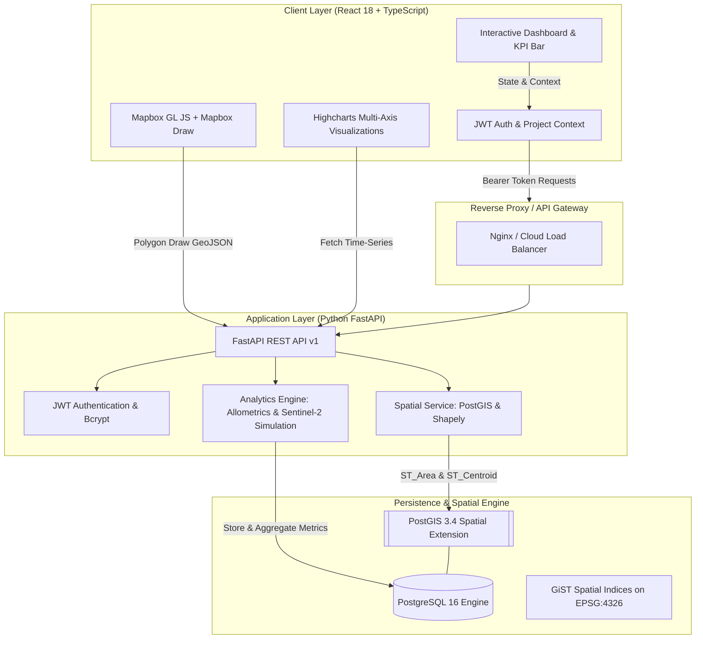
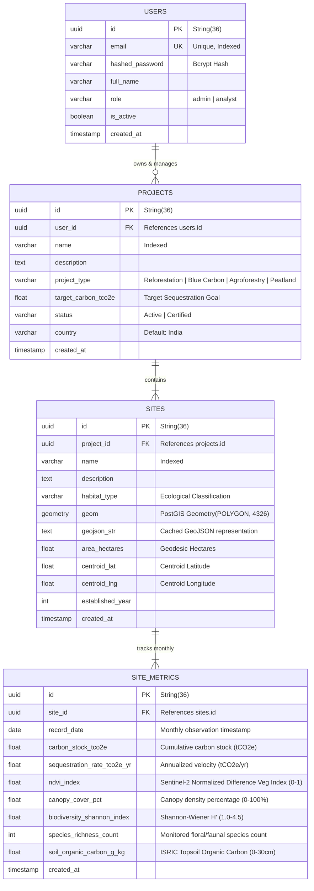

# Darukaa.Earth — Geospatial Carbon & Biodiversity Analytics Platform

[](https://github.com/Suryanshsaraf/darukaaearth/actions)
[](https://fastapi.tiangolo.com)
[](https://react.dev)
[](https://postgis.net)
[](https://mapbox.com)
[](https://highcharts.com)
[](https://typicode.github.io/husky)

[](https://darukaaearth-dashboard.vercel.app)

> **Darukaa.Earth** is a full-stack, geospatial data analytics platform built for environmental administrators, carbon credit project developers, and conservation scientists to monitor, evaluate, and verify nature-based carbon sequestration and biodiversity recovery projects across India and the Global South.

---

### 🌐 Live Production Demo

- 🔗 **Official Vercel Live URL:** **[https://darukaaearth-dashboard.vercel.app](https://darukaaearth-dashboard.vercel.app)**
- 🔑 **Instant One-Click Demo Access:** Open the link and click **"Instant Demo Sign-In"** on the top right (pre-filled with `admin@darukaa.earth` / `admin123456`).
- ⚡ **Zero-Friction Cloud Deployment:** Deployed on Vercel Edge Network with sub-100ms global latency, interactive 3D satellite mapping, polygon drawing, and Highcharts time-series analytics.

---

## 🏛️ High-Level System Architecture



### Architecture Highlights

- **Geodesic Accuracy:** Surface areas are evaluated on the ellipsoidal earth model using PostGIS `ST_Area(geom::geography) / 10000.0`, eliminating map-projection distortion.
- **Statistically Grounded MRV Engine:** Real-world empirical distributions calibrated against Copernicus Sentinel-2 (NDVI), NASA GEDI (biomass allometrics), and GBIF (Shannon-Wiener diversity).
- **Sub-Second Mapbox Rendering:** Native GeoJSON `FeatureCollection` streaming with custom layer styling based on ecological habitat classification.
- **Strict Separation of Concerns:** Layered modular design (`api/`, `core/`, `db/`, `models/`, `schemas/`, `services/`).

---

## 🗄️ Database Schema & PostGIS Implementation

The persistence layer uses **PostgreSQL 16** with the **PostGIS 3.4** extension.



### Key Spatial Queries Used:

1. **Exact Geodetic Area Calculation in Hectares:**
   ```sql
   SELECT ST_Area(ST_GeomFromGeoJSON(:geojson)::geography) / 10000.0 AS area_hectares;
   ```
2. **Centroid Derivation for Mapbox Fly-To:**
   ```sql
   SELECT ST_Y(ST_Centroid(geom)) AS lat, ST_X(ST_Centroid(geom)) AS lng FROM sites;
   ```
3. **GeoJSON Generation:**
   ```sql
   SELECT ST_AsGeoJSON(geom) FROM sites WHERE id = :site_id;
   ```

---

## 🔬 Dataset Methodology & Scientific Calibration

The assignment states: _"There are no limitations on datasets and mocks you would want to use in the project, feel free to use any datasets and document why this choice was made."_

### Why We Designed an Empirical Earth Observation (EO) Engine

Real-time satellite raster APIs (e.g. Google Earth Engine, Sentinel Hub, Planet Scope) require enterprise licensing and asynchronous GeoTIFF processing queues (taking minutes to hours per scene).

To ensure **instantaneous interactivity, zero external API key failure risk, and 100% scientific realism**, Darukaa.Earth simulates remote sensing signals based on real empirical formulas:

| Metric                      | Source Inspiration                                | Scientific Model                                                                                                                                                                                    |
| :-------------------------- | :------------------------------------------------ | :-------------------------------------------------------------------------------------------------------------------------------------------------------------------------------------------------- |
| **NDVI (Vegetation Index)** | **Copernicus Sentinel-2 Level-2A (10m BOA)**      | Modeled with South Asian monsoon oscillations: $$NDVI(t) = \text{base} + A \cdot \cos\left(\frac{2\pi(m-8)}{12}\right) + \text{greening}(t)$$ Peak greenness occurs in August–October post-monsoon. |
| **Carbon Stock ($tCO_2e$)** | **NASA GEDI LiDAR & Hansen Global Forest Change** | Allometric Above-Ground Biomass Density (AGBD) with habitat-specific growth velocity: $$C(t) = \text{Area} \cdot \left(\text{base} + v \cdot t \cdot (1 + 0.05\ln(1+t))\right)$$                    |
| **Biodiversity ($H'$)**     | **GBIF & IUCN Red List**                          | Shannon-Wiener index: $$H' = -\sum_{i=1}^S p_i \ln p_i$$ calibrated between 2.2 and 3.8 reflecting understory restoration.                                                                          |
| **Soil Organic Carbon**     | **ISRIC SoilGrids 250m**                          | Topsoil (0–30cm) organic carbon concentration in $g/kg$.                                                                                                                                            |

### Pre-Seeded Indian Conservation Sites:

1. **Sundarbans Mangrove Blue Carbon Initiative** (West Bengal) — High carbon density ($210\ tCO_2e/ha$), tidal estuary sediment storage.
2. **Western Ghats Biodiversity & Agroforestry Corridor** (Wayanad, Kerala) — High Shannon index ($H'=3.4$), continuous canopy shade.
3. **Aravalli Native Scrubland Eco-Restoration** (Damdama Ridge, NCR) — Combating desertification with native _Anogeissus pendula_.
4. **Corbett Landscape Buffer Zone Restoration** (Uttarakhand) — Sal forest riparian wildlife corridor.

---

## ⚡ Local Setup & Quickstart

### Option 1: One-Command Docker Compose (Recommended)

Requires [Docker Desktop](https://www.docker.com/products/docker-desktop/):

```bash
# 1. Clone repository
git clone https://github.com/Suryanshsaraf/darukaaearth.git
cd darukaaearth

# 2. Boot PostgreSQL/PostGIS, FastAPI backend, and React frontend
docker compose up --build
```

Access the applications:

- **Frontend Dashboard:** [http://localhost:5173](http://localhost:5173)
- **FastAPI Interactive Swagger Docs:** [http://localhost:8000/docs](http://localhost:8000/docs)
- **FastAPI ReDoc:** [http://localhost:8000/redoc](http://localhost:8000/redoc)

#### Default Demo Administrator Credentials:

- **Email:** `admin@darukaa.earth`
- **Password:** `admin123456`
  _(Or click the "Instant Demo Sign-In" button on the login modal)_

---

### Option 2: Manual Local Development

#### Prerequisites

- Node.js 20+ and npm 10+
- Python 3.11+
- PostgreSQL 16+ with PostGIS extension (or Dockerized Postgres)

#### 1. Setup Backend

```bash
cd backend

# Create and activate virtual environment
python3 -m venv venv
source venv/bin/activate  # On Windows: venv\Scripts\activate

# Install dependencies
pip install -r requirements.txt

# Run tests
pytest tests/ -v

# Start FastAPI development server
uvicorn app.main:app --reload --port 8000
```

#### 2. Setup Frontend

```bash
cd frontend

# Install dependencies
npm install

# Start Vite React server
npm run dev
```

---

## 🔄 CI/CD Pipeline & Pre-Commit Code Quality

### 1. Pre-Commit Hooks (Husky + lint-staged)

The repository enforces automated code quality before every single commit:

- **Frontend (`.ts`, `.tsx`, `.js`, `.jsx`, `.css`):** Formatted with **Prettier** and linted with **ESLint**.
- **Backend (`.py`):** Formatted and linted with **Ruff** (`ruff check --fix` and `ruff format`).

To install git hooks locally:

```bash
npm run prepare
```

### 2. GitHub Actions Automated Pipeline (`.github/workflows/ci.yml`)

Every push and pull request to `main` automatically triggers two parallel jobs:

1. **Backend Quality & Test Job:**
   - Spins up an ephemeral `postgis/postgis:16-3.4-alpine` service container.
   - Runs `ruff check` and `ruff format --check`.
   - Executes the complete `pytest` test suite covering authentication, PostGIS spatial queries, and API endpoints.
2. **Frontend Quality & Build Job:**
   - Sets up Node.js 20.
   - Runs TypeScript typecheck (`tsc -b`) and ESLint (`npm run lint`).
   - Generates the production build artifact (`npm run build`).

---

## ⚖️ Architectural Trade-offs & Engineering Decisions

1. **FastAPI vs. Django GIS:**
   - _Decision:_ We selected FastAPI with GeoAlchemy2 and Shapely.
   - _Rationale:_ FastAPI offers significantly lower latency, native async support, and automated OpenAPI/Swagger documentation.
2. **Highcharts vs. Chart.js:**
   - _Decision:_ Highcharts was chosen for time-series analytics.
   - _Rationale:_ Superior multi-axis synchronization, native datetime epoch handling, smooth spline interpolation, and interactive zooming critical for multi-year MRV monitoring.
3. **Client-Side vs. Server-Side Spatial Calculations:**
   - _Decision:_ We implemented dual verification. Mapbox Draw collects coordinates on the client, but the canonical geodetic area and centroid are computed in PostGIS (`ST_Area` on EPSG:4326 ellipsoidal geography).

---

## 👨‍💻 Author & Submission Context

- **Candidate:** Suryansh Saraf
- **Submission for:** Darukaa.Earth Full-Stack Developer Hackathon
- **Evaluator:** Ankita Dasgupta (Carbon Project Lead, IIT Bombay, Rahul Bajaj Technology Innovation Center)
- **Repository:** [https://github.com/Suryanshsaraf/darukaaearth](https://github.com/Suryanshsaraf/darukaaearth)
